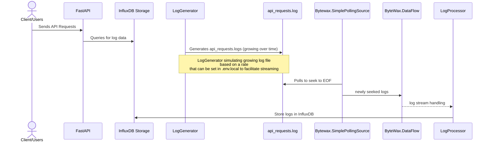

### System Design :

```mermaid
sequenceDiagram
    actor Client/Users
    participant FastAPI
    participant InfluxDB Storage
    participant LogGenerator
    participant api_requests.log
    participant Bytewax.SimplePollingSource
    participant ByteWax.DataFlow
    participant LogProcessor
    
    Client/Users->>FastAPI: Sends API Requests
    FastAPI->>InfluxDB Storage: Queries for log data

    LogGenerator->>api_requests.log: Generates api_requests.logs (growing over time)
    Note over LogGenerator,api_requests.log: LogGenerator simulating growing log file<br>based on a rate <br> that can be set in .env.local to facilitate streaming
    
    Bytewax.SimplePollingSource ->>api_requests.log: Polls to seek to EOF
    Bytewax.SimplePollingSource->>ByteWax.DataFlow: newly seeked logs
    ByteWax.DataFlow-->>LogProcessor : log stream handling
    LogProcessor->>InfluxDB Storage: Store logs in InfluxDB
```

