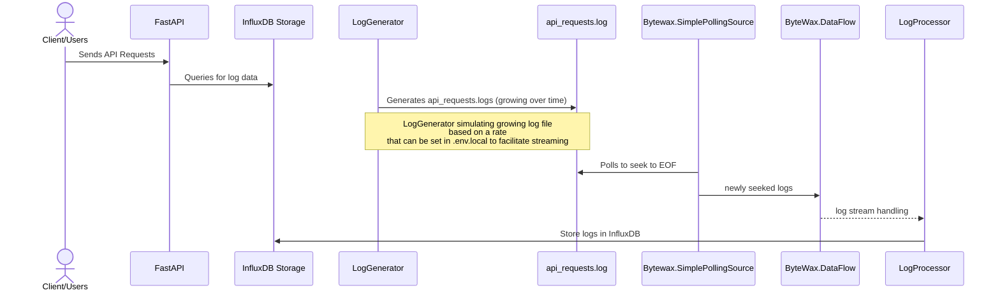

### Logs -> Bytewax -> InfluxDB :



---

## Run the project
```bash
chmod +x ./start.sh && ./start.sh
```

---

### What does `start.sh`do ?
- `start.sh` will run 4 docker containers using docker-compose, `log_generator`, `log_processor`, `influx_db`, `api`.
- What happens when `start.sh` is launched:

  - we remove any previous log files to give us a fresh start.
  - we remove any data influxdb to give us a fresh start.
  - we create empty log files for service logs as well as `./src/log_generator/api_requests.log` which is where `log_generator` service will append logs.
  - we also do some other cleanup to give us fresh start, stopping existing running containers, removing volumes for these services.
  - Next, we spin up InfluxDB which is time series nosql database, docker-compose takes care of initialising it with required credentials, bucket_name, org_name etc.
  - All metadata which is used in initialising InfluxDB is read from `.env.local` file.
  - We then wait for InfluxDB to be healthy.
  - We then spin up log_processor.
  - We then spin up log_generator which waits for log_processor to spin up.

---

### Log Generator
- `log_generator` starts writing logs in `src/log_generator/api_requests.log` automatically:
  - Log generation happens at a rate. This rate is basically `LOG_BATCH_SIZE` per `LOG_INTERVAL_SECONDS` and stops after `MAX_LOGS_TO_GENERATE`, you can adjust these, `CTRL +C` and start again `start.sh`. 
  - For example : `LOG_BATCH_SIZE=1` and `LOG_INTERVAL_SECONDS=60` means Log Generator will ingest one log line per `60` seconds. You can increase or decrease it but to understand the flow it's recommended to keep it at low as possible.

---

### Log Processor
  - Once it's ready, it creates a DataFlow, waits for PollingSource to seek logs by polling every 1ms.
  - LogProcessor uses `ByteWax.SimplePollingSource` to poll the log file Log Generator creates (`api_requests.log`) and seeks to the EOF and hands over the log line to `ByteWax.DataFlow`.
  - The log stream is then collected using Bytewax collect feature `bytewax.operators.collect`.
  - There are two configs here which are important and might need re-adjusting based on how fast we want to reflect data for api users.
```python
collected_stream = op.collect(
        "log_processor_flow", log_stream,
        timeout=timedelta(seconds=STREAM_MAX_WAIT_TIME_IN_SECONDS), # after these many seconds all lines read by polling source, stream of list of log lines is handed over to log_processor.handle_log
                                                                    # or
        max_size=STREAM_MAX_SIZE # after these many log lines read by polling source, stream of list of log lines is handed over to log_processor.handle_log
    )
```
  - `log_handler.py` will batch write the logs in the db.
  - `log_processor` is running 4 workers which can parallelize the stream work and number of workers can be passed when building the docker image as env vars.

---

### API
- Available once project starts on `http://127.0.0.1:8000/docs`
- Sample request
```bash
curl -X 'GET' \
  'http://127.0.0.1:8000/customers/cust_1/stats?from_date=1970-01-01' \
  -H 'accept: application/json'
```
---

### How to validate results ?
- Hit the Api mentioned below but make sure to look for logs `less src/log_generator/api_requests.log` so you can validate API results with logs.
- You can also run integration tests to validate results, read below how to run them.
- Pro tip: reduce log frequency of log generator
- Inside the .env.local change log generator env variables to reduce the frequency slow down logs and see clearly the flow of action.
```bash
# Log generator
LOG_BATCH_SIZE=1
LOG_INTERVAL_SECONDS=1
LOG_FILE_PATH=api_requests.log
MAX_LOGS_TO_GENERATE=100
```
This will generate a total of 100 logs at the rate of 1 log per second.

---

### Run Tests
- Will run 22 tests, some of which are unit test, some are integration tests.
```bash
chmod +x ./run_tests.sh && run_tests.sh
```

---

### Want to manually run tests ?
- Test get your local setup ready for running local tests run:
```bash
chmod +x ./testmode.sh && testmode.sh
```
- Then you can run the test as below (example):
- ```bash
docker exec -it log_processor python -m unittest test_logprocessor_storage_integration.TestCustomerStatsIntegration.test_log_handler_and_storage
```

---

### Clean up (optional)
Clean setup if you want but it is not required as other scripts will run a clean up before doing what they need to.
```bash
chmod +x ./cleanup.sh && ./cleanup.sh
```

---

- <p style="color: red">Note: that <code>`chmod`</code> command is required only the first time.</p>

# Future improvements

- Log file watching could be done better with watchdog event listeners.
- Could introduce caching for customer queries to speed up APIs and take the load off InfluxDB
- InfluxDB query could be async IO but inbuilt library lacks support but has http API.
- Re-think about db cardinality as customer_id is saved under tags.