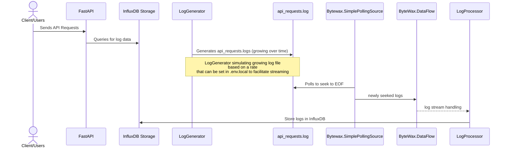

### Logs -> Bytewax -> InfluxDB :



#### Run the project
```bash
chmod +x ./start.sh && ./start.sh
```

```bash
chmod +x ./cleanup.sh && ./cleanup.sh
```

- Note that `chmod` command is required only the first time.


### Log Generator
- Log Generator (`src/log_generator`) : Responsible for ingesting logs in `api_requests.log` at a rate. This rate is basically `LOG_BATCH_SIZE` per `LOG_INTERVAL_SECONDS`. 
- For example : `LOG_BATCH_SIZE=1` and `LOG_INTERVAL_SECONDS=60` means Log Generator will ingest one log line per `60` seconds. You can increase or decrease it but to understand the flow it's recommended to keep it at low as possible. 

### Log Processor
- LogProcessor uses `ByteWax.SimplePollingSource` to poll the log file Log Generator creates and seeks to the EOF and hands over the log line to `ByteWax.DataFlow` which hands it over to Log Handler which does some simple string to dict transformation and dumps it in the InfluxDB
- LogProcessor has some unit tests and some integration test that test against the InfluxDB docker instance.

```bash
chmod +x ./run_tests.sh && run_tests.sh
```

- If the containers are running, you can also run the tests using docker commands

```bash
docker run --rm -it log_processor python -m unittest
```

### RestApi to search logs for customers

- Is under progress ...

### Stuff in todo
- Rest Api integration
- Query fixing to cover all days from start date
- Add tests for Api
- Validate sanity with integration tests
- Consider optimizing query
- Async query to db using custom http implementation (bit lengthy task but possible)