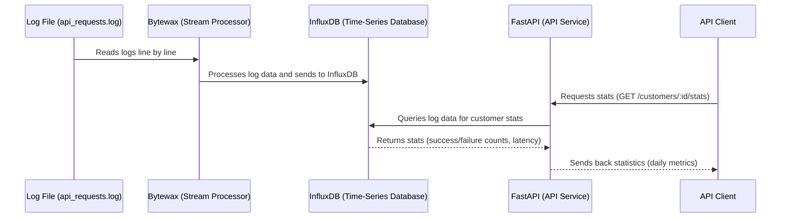
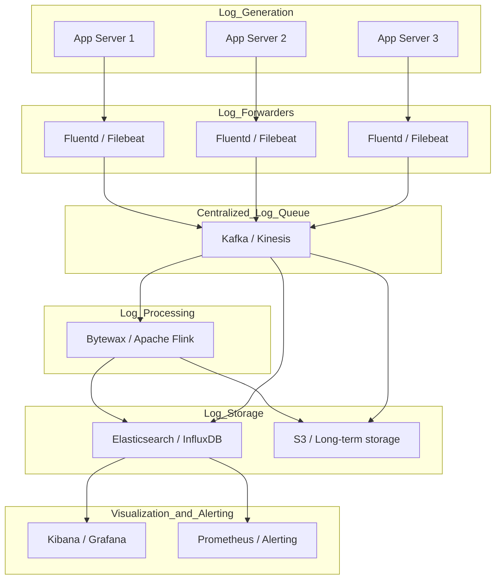

### Exercise Brief: Log Processing and API Development

#### Objective

This exercise is designed to assess your ability to work with log data, process it to populate a database, and build an API endpoint to expose relevant statistics.

#### Tasks

1. **Generate Log File**:
   - Use the provided log generator script (`generator.py`) to create a log file named `api_requests.log`.
   - Ensure the log file includes fields: `timestamp`, `customer_id`, `request_path`, `status_code`, and `duration`.

2. **Populate Local Database**:
   - Create a local database and define an appropriate schema. Can be anything you like (SQL or NoSQL).
   - Write a script to read `api_requests.log`, process it and insert the results into the database.

3. **Build API Endpoint**:
   - Develop an API using a web framework of your choice (e.g., FastAPI, Django).
   - Implement a single API endpoint: `/customers/:id/stats?from=YYYY-MM-DD`
     - This endpoint should return daily statistics for a specific customer starting from the given date.
     - The statistics should include:
        - Total number successful and failed requests
        - Uptime
        - Average latency, median latency and p99 latency

#### Deliverables

In a GitHub repo, please include the following:

1. **Generated Log File**: `api_requests.log` created using the provided generator script.
2. **Log Processor**: Script to create the database schema and populate it with log data.
3. **API Implementation**: Source code for the API with the required endpoint.
4. **README**: A brief README file with instructions on how to set up and run the database script and API server.

Please make sure your solution can be run with a single command, and all setup steps have been automated.

Bonus points for:
- Processing the file in a streaming fashion using Bytewax
- Using FastAPI for the endpoint
- Docker Compose for easy setup

Good luck!

### NOTES:
- [ ] Revisit docker-compose
- [ ] Retest one command setup
- [ ] Should be 12 factor app compliant
- [ ] Assumption made that logs fields will not be null, absense of a log field will mean rejected for processing.
- [ ] 1 million request per second, data retention 30 days
- [ ] Reduce cardinality
- [ ] use one .env.local file for docker compose, docker files and everything else like log processor, bytewax

### Thoughts : 
- Since Bytewax and Streaming is mentioned, the data will probably come in streams and not in batches
- For batch inserts postgres should be fine but this project is probably demanding stream ingestion.
- For streams (data as it is available) inserts / ingestion rate postgres will do poorly at high ingestion rates like 1 mil rows per second 
  without optimization because of increased disk space and cause slow queries, a good fit here could be a time series db store because logs have timestamps. 
- The request for the api will have customer_id and date for which we need to return stats, the calculation of p99, median and avg latency are also required.
- Looks like a influx db satisfy the log processing requirement and also the log search requirement too because it has inherent support for p99, median, avg calculations. 

### System Design :

