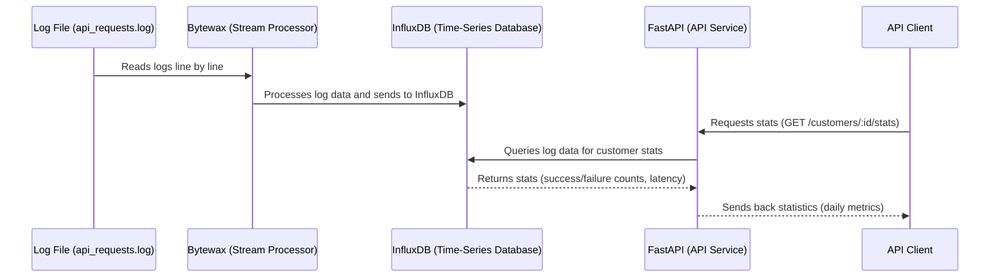

### NOTES:
- [ ] Revisit docker-compose
- [ ] Retest one command setup
- [ ] Should be 12 factor app compliant
- [ ] Assumption made that logs fields will not be null, absense of a log field will mean rejected for processing.
- [ ] 1 million request per second, data retention 30 days
- [ ] Reduce cardinality
- [ ] use one .env.local file for docker compose, docker files and everything else like log processor, bytewax

### Thoughts : 
- Since Bytewax and Streaming is mentioned, the data will be processed in streams 
- For batch inserts postgres should be fine but this project is probably demanding stream ingestion.
- For streams (data as it is available) inserts / ingestion rate postgres will do poorly at high ingestion rates like 1 mil rows per second 
  without optimization because of increased disk space and cause slow queries, a good fit here could be a time series db store because logs have timestamps. 
- The request for the api will have customer_id and date for which we need to return stats, the calculation of p99, median and avg latency are also required.
- Looks like a influx db satisfy the log processing requirement and also the log search requirement too because it has inherent support for p99, median, avg calculations. 

### System Design :

